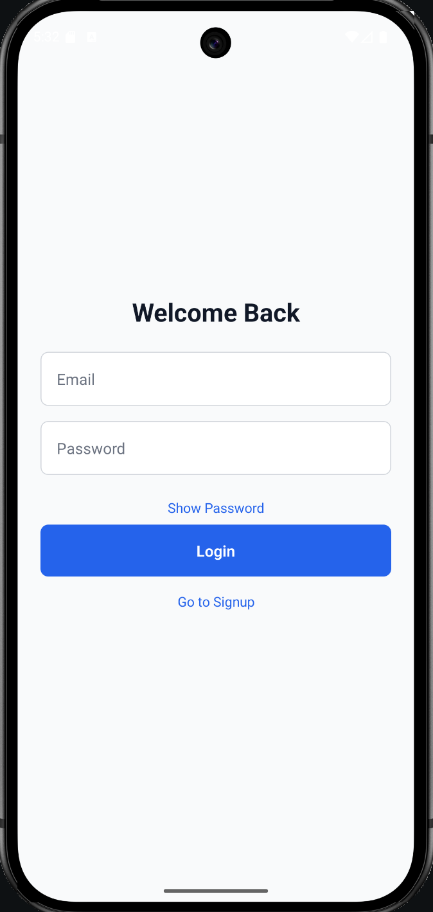

# Mobile Authentication App (React Native)

## Overview

This is a **React Native mobile app** demonstrating **Login and Signup functionality** using **React Context API** to manage authentication state.  

The app includes:

- Authentication flow (Login, Signup, Logout)
- Form validation (email format, password length, required fields)
- Password visibility toggle
- Navigation between screens
- Persisted authentication using **AsyncStorage** (optional)
- Light theme with reusable components

This project is designed to be **clean, scalable, and interview-ready**.

---

## Features

### Login Screen
- Email and password input
- Validation: invalid email / missing password
- Password visibility toggle
- Navigate to Signup screen

### Signup Screen
- Name, email, password input
- Validation: missing fields, invalid email, password < 6 chars
- Password visibility toggle
- Navigate to Login screen

### Home Screen
- Shows currently logged-in user's name and email
- Logout button

### Authentication Context
- `login`, `signup`, `logout` functions
- Global user state
- Optional AsyncStorage persistence

### Theme
- Light theme with consistent colors, spacing, and typography
- Reusable Input and Button components

### Unit Testing
- Tests AuthContext functions (`signup`, `login`, `logout`)
- Uses `@testing-library/react-native` and `jest`
- AsyncStorage mocked for test environment

---

## Folder Structure

```
src/
├── app/
│ └── context/
│ └── AuthContext.tsx
├── presentation/
│ ├── components/
│ │ ├── Input.tsx
│ │ └── PrimaryButton.tsx
│ ├── screens/
│ │ ├── LoginScreen.tsx
│ │ ├── SignupScreen.tsx
│ │ └── HomeScreen.tsx
│ └── theme/
│ └── theme.ts
├── navigation/
│ └── AppNavigator.tsx
├── utils/
│ └── validators.ts
└── App.tsx
```


---

## Getting Started

### Prerequisites

- Node.js (>=18 recommended)  
- npm or yarn  
- React Native CLI / Expo CLI  

### Install Dependencies

```bash
npm install
# or
yarn install
```

Running the App
For iOS
npx react-native run-ios

For Android
npx react-native run-android

Running Unit Tests

This project uses Jest and React Native Testing Library.

Jest Setup (AsyncStorage Mock)

jest.setup.ts:
```bash
import mockAsyncStorage from '@react-native-async-storage/async-storage/jest/async-storage-mock';

jest.mock('@react-native-async-storage/async-storage', () => mockAsyncStorage);
```

jest.config.js:
```bash
module.exports = {
  preset: 'react-native',
  setupFilesAfterEnv: ['./jest.setup.ts'],
  transformIgnorePatterns: [
    'node_modules/(?!(react-native|@react-native|@react-navigation)/)',
  ],
};
```

Run Tests
```bash
npm test
# or
yarn test
```

## Screenshots

<p align="center">
  
  
  
</p>

## Demo Video

<video src="screenshots/klaudius.gif" controls width="600"></video>

[▶ Download / Watch Demo Video](screenshots/klaudius.gif)